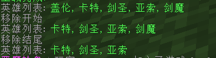

# 🖥️ Function 内置方法


内置的方法只是常用方法，你依然可以使用JavaTask对方法进行扩展，当然你也需要一些编程知识，了解Bukkit。


## 消息类

### &#x20;tell 发送文本消息

> **tell(message)  @目标指示器**
>
> 给目标发送一条聊天框消息
>
> 参数:&#x20;
>
> * 消息内容

### notice 发送全体消息

> #### notice(message)
>
> 给游戏房间内的所有玩家发送一条聊天框消息 **（无目标方法）**

### say 发送聊天消息

> #### say(message) **@目标指示器**
>
> 由目标发送一条聊天框消息
>
> 参数:&#x20;
>
> * 消息内容

### title 发送标题消息

> #### title(主标题, 副标题, 淡入时间, 持续时间, 淡出时间) **@目标指示器**
>
> 给目标发送一条标题消息
>
> 参数:&#x20;
>
> * 主标题（必填）
> * 副标题（非必填）
> * 淡入时间（非必填）默认 10
> * 持续时间（非必填）默认 70
> * 淡出时间（非必填）默认 10

```
// 支持的写法
title(只有大标题) @p
title(有大标题, 也有小标题) @p
title(有标题, 也有动画设定, 10, 20, 10) @p
```

### actionbar 发送Actionbar

> #### actionbar(message) **@目标指示器**
>
> 给目标发送物品栏消息
>
> 参数:
>
> * message 消息内容

### log 发送调试消息

> #### log(message)
>
> 在控制台打印消息，用于调&#x8BD5;**（无目标方法）**&#x20;
>
> 参数:
>
> * message 消息内容

### command 目标执行指令

> #### command(cmd) **@目标指示器**
>
> 目标以OP的身份执行指令
>
> 参数:
>
> * cmd 执行的指令

### consolecommand 控制台执行指令

> #### consolecommand(cmd)
>
> 控制台执行指令
>
> 参数:
>
> * cmd 执行的指令

##

## 玩家类

### setspawn 设置重生点

> #### setspawn() **@目标指示器**
>
> 设置当前位置为玩家的出生点，死亡后在此位置重生

### setproperty 设置属性

> #### setproperty(attr, value) **@目标指示器**
>
> 设置玩家的常规属性值
>
> 参数:
>
> * attr 属性名
> * value 属性值

```
// 支持的属性
setproperty(maxhealth, 50) @p  #最大生命值
setproperty(health, 30) @p # 设置当前生命值
setproperty(speed, 1.5) @p # 设置移动速度
setproperty(food, 20) @p # 设置饥饿值

✅ CsgPro 2.0.3+
setproperty(gamemode, 1) @p # 设置游戏模式 
```

### damage 造成伤害

> #### damage(num) **@目标指示器**
>
> 对玩家造成指定数额的伤害
>
> 参数:
>
> * num 造成的伤害值

### clear 清理背包

> #### clear() **@目标指示器** ✅ CsgPro 2.0.3+
>
> 清除玩家指定位置的物品

```yaml
# 无参数写法
clear() @p #清理玩家所有物品

# 有参写法 （类型，槽位）
clear(SLOT, 1) @p #清理玩家背包指定槽位的物品
clear(QUICK_BAR) @p # 清理玩家背包的快捷栏的物品
```

### teleport 传送目标

> #### teleport(loc) **@目标指示器**
>
> 传送玩家至指定坐标
>
> 参数:
>
> * loc 坐标文本

```yaml
// 可被解析的写法
teleport(jz;0;100;0) @p 
// 世界;X;Y;Z

teleport(0 100 0 jz) @p 
// X Y Z 世界
```

### spawnmob 生成实体

> #### spawnmob(type,loc)
>
> 生成指定实体
>
> 参数:
>
> * `type` 实体类型
> * `loc` 坐标文本

```yaml
// 可被解析的写法
spawnmob(ZOMBIE,jz;0;100;0) 
```

### setblock 设置方块

> #### setblock(type,loc)
>
> 设置某个坐标的方块为指定类型的方块
>
> 参数:
>
> * `type` 方块类型
> * `loc` 坐标文本

```yaml
// 可被解析的写法
setblock(AIR, jz;0;100;0)
```

## 队列类

### join 加入游戏

> #### join(group) **@目标指示器**
>
> 使目标加入指定的队列
>
> 参数
>
> * group 队列名称

```
join(Red) @p
```

### leave 离开游戏

> #### leave() **@目标指示器**
>
> 使目标离开当前游戏房间

```
leave() @p
```

### drivide 均衡分配

> #### drivide() ✅ CsgPro 2.0.0+
>
> 队列平均随机分配玩家
>
> 参数:
>
> gourp... 多个队列名称

```
drivide(Red, Blue) 
// 将游戏房间内的所有玩家平均分配至Red, Blue两个队列中

drivide(Red, Blue, Yellow, Pink)
// 将游戏房间内的所有玩家平均分配至Red, Blue, Yellow, Pink等多个队列可继续无限添加
```

## 变量类

### macro 全局变量

> macro()
>
> 宏变量（全局变量）可在Macro.yml文件中预定义值，多种语法

<pre class="language-yaml"><code class="lang-yaml"><strong># 设置宏变量 deathamount的值为 2
</strong><strong>macro(deathamount, 2) 
</strong><strong>
</strong><strong># {deathamount} 是调用宏的写法
</strong>notice(这局游戏最大死亡数： {deathamount})
</code></pre>

<figure><figcaption><p>游戏内输出效果</p></figcaption></figure>

```yaml
# 使用 +/- 可以对数值类宏变量进行递增

macro(deathamount, 1) 
notice(这局游戏最大死亡数： {deathamount})
macro(deathamount, +2) 
notice(更新游戏最大死亡数： {deathamount})
macro(deathamount, -3) 
notice(更新游戏最大死亡数： {deathamount})
```

<figure><figcaption><p>执行效果</p></figcaption></figure>

**进阶一: 列表用法**  ✅ CsgPro 2.0.0+

```yaml
# 使用 macro(变量, 操作标识, 数值) 进行列表操作
macro(heroList, add, 盖伦) 
macro(heroList, add, 卡特) 
macro(heroList, add, 剑圣)
macro(heroList, add, 亚索)
macro(heroList, add, 剑魔)
tell(&7英雄列表: &a{heroList}) @p  # 输出数据
macro(heroList, del, 剑魔)
macro(heroList, del, 亚索)
tell(&7英雄列表: &a{heroList}) @p
# 获取第二个英雄：请注意索引是从0开始的
tell(&7指定英雄: &a{heroList.1}) @p
```

<figure><figcaption><p>执行效果</p></figcaption></figure>

**列表扩展**

```yaml
✅ CsgPro 2.0.3+

macro(heroList, add, 盖伦) 
macro(heroList, add, 卡特) 
macro(heroList, add, 剑圣)
macro(heroList, add, 亚索)
macro(heroList, add, 剑魔)
tell(&7英雄列表: &a{heroList}) @p
tell(&7移除开始) @p
macro(heroList, delstart)
tell(&7英雄列表: &a{heroList}) @p
tell(&7移除结尾) @p
macro(heroList, delend)
tell(&7英雄列表: &a{heroList}) @p


✅ CsgPro 2.0.4+

# 判断指定数据是否位于列表中
# 注意！这个返回的是true / false
macro(heroList, contains, 盖伦) 

# 如果要使用判断的话参考下面例子
result -> macro(heroList, contains, 盖伦) 
if({result})
    tell(存在数据) @p
    end()
tell(不存在数据) @p
```

<figure><figcaption><p>执行效果</p></figcaption></figure>

### setscore 设置玩家变量

> #### setscore(name, val) @目标指示器
>
> 设置某个玩家的分数值，仅支持数值类型

```
# 设置目标玩家 hitscore 的值为 5
setscore(hitscore, 5) @p 

# 使用 +/- 可以对变量进行递增和递减

setscore(hitscore, +1) @p
setscore(hitscore, -2) @p
```

### getscore 获取玩家变量&#x20;

> #### getscore(name, val) @目标指示器
>
> 获取某个玩家的分数值

```
x -> getscore(hitscore) @p
tell(你的得分是: {x})
```

##

## 流程控制类

### if 判断条件

> #### if(条件式) @选择器
>
> 判断如果条件式满足的情况下执行的逻辑

```
# 判断玩家玩家血量是否低于20
if({player.health} < 5)
    tell(你的生命值过低！小心！) @p
```

该例子会在执行的时候判断玩家生命值如果低于5则执行tell行为

同时你也可以使用ELSE在if不触发的时候进行其他操作

```
# 判断玩家的等级是否大于5
if({player.level} > 5)
    tell(等级满足，可以进行挑战！) @p
else
    tell(等级不足，你仍需进行努力！) @p
```

该例子会在玩家等级>5的时候执行 `等级满足，可以进行挑战！`  如果不满足条件则输出 `等级不足，你仍需进行努力！`
